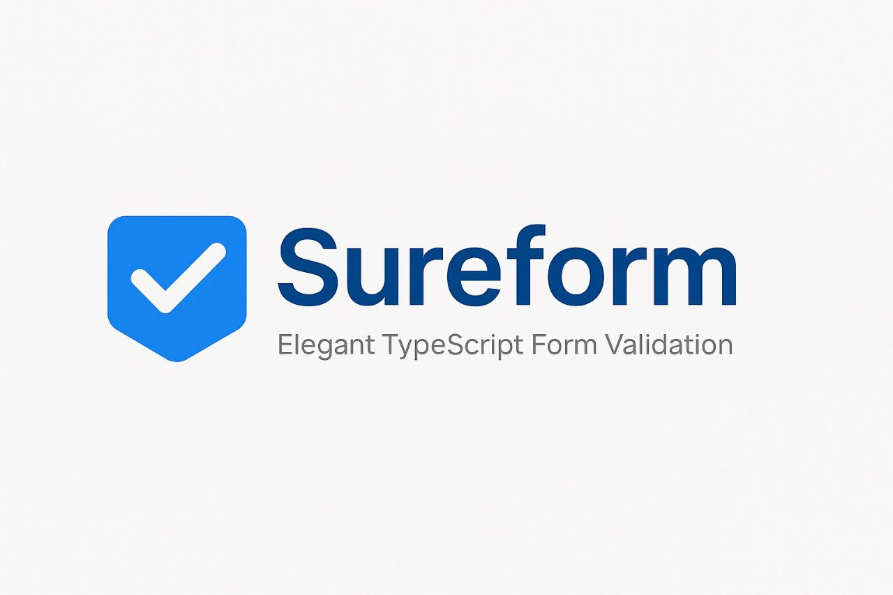

# SureForm - TypeScript Validation Library

**SureForm** is a lightweight, extensible validation library written in TypeScript. It allows you to define clean, reusable validation schemas for JavaScript or Vue.js projects, supporting both built-in and custom rules, friendly error messages, field labels, advanced rules, wildcard paths, and inline callback validators.



## 📦 Installation

```bash
# npm
npm install sureform

---

## 🚀 Quick Start

```ts
import { Validator } from 'sureform';

const data = {
  username: '',
  email: 'foo@bar.com',
  age: '17',
  tags: ['a', 'b'],
};

const schema = {
  username: ['required', 'min:3'],
  email: ['required', 'email'],
  age: ['numeric', 'min:18'],
  tags: ['array', 'min:1'],
};

const v = new Validator(data, schema);
const result = v.validate();

if (!result.valid) {
  console.log(result.errors);
}
```

---

## 🧰 Core Features

- Simple and fluent API for rule definitions
- **Schema-based validation**: Define rules per field.
- **Built-in rules**: `required`, `string`, `numeric`, `boolean`, `array`, `email`, `url`, `min`, `max`, `between`.
- **Advanced rules**: `regex`, `not-regex`, `in-array`, `file-type`.
- **Wildcard support**: Validate array items with `field.*.subfield`.
- **Custom messages**: Override global or field-specific messages, with `:field` placeholder.
- **Custom field labels**: Provide human-friendly names.
- **Callback rules**: Use inline functions returning `true` or error message string.
- **Extensible**: Register new rules via `RuleFactory`.

---

### Basic Rules

| Rule       | Description                                       | Syntax                     |
| ---------- | ------------------------------------------------- | -------------------------- |
| `required` | Field must be non-empty                           | `"required"`               |
| `string`   | Value must be a string                            | `"string"`                 |
| `numeric`  | Value must be numeric                             | `"numeric"`                |
| `boolean`  | Value must be boolean                             | `"boolean"`                |
| `array`    | Value must be an array                            | `"array"`                  |
| `email`    | Validates email format                            | `"email"`                  |
| `url`      | Validates URL format                              | `"url"`                    |
| `min`      | Min length/value (strings, arrays, numbers)       | `"min:<value>"`            |
| `max`      | Max length/value (strings, arrays, numbers)       | `"max:<value>"`            |
| `between`  | Value between min and max inclusive               | `"between:<min>,<max>"`    |

### Advanced Rules

| Rule       | Description                                        | Syntax                         |
| ---------- | -------------------------------------------------- | ------------------------------ |
| `regex`    | Matches regular expression                         | `"regex:<pattern>"`            |
| `not-regex` | Must *not* match pattern                           | `"not-regex:<pattern>"`         |
| `in-array`  | Value in list                                      | `"in-array:<val1>,<val2>,..."`  |
| `file-type` | File MIME type match (`File.type`)                 | `"file-type:<mime1>,<mime2>"`   |

---

## 🔧 Custom Messages & Field Labels

Pass `messages` and `fields` to the `Validator` constructor:

```ts
const data = { name: '', email: '' };
const schema = { name: ['required'], email: ['required', 'email'] };

const messages = {
  'name.required': 'Please enter your full name.',
  'required': ':field is mandatory.',
  'email': 'The :field must be a valid email address.'
};

const fields = {
  name: 'Full Name',
  email: 'Email Address',
};

const v = new Validator(data, schema, messages, fields);
const res = v.validate();

console.log(res.errors);
// {
//   name: ['Please enter your full name.'],
//   email: ['The Email Address must be a valid email address.']
// }
```

- **Field-specific**: `messages['field.rule']`
- **Global rule**: `messages['rule']`
- **`:field`** placeholder replaced by label or field key
- **Fallback**: rule’s default message

---

## 🌐 Wildcard Validation

Use `*` to iterate over array items:

```ts
const data = { users: [{ email: 'a@b.com' }, { email: 'bad' }] };
const schema = {
  'users.*.email': ['required', 'email']
};

const v = new Validator(data, schema);
console.log(v.validate().errors);
// { 'users.1.email': ['users.1.email must be a valid email address'] }
```

---

## ⚙️ Callback (Inline) Rules

Define inline functions in `schema`:

```ts
const schema = {
  age: [
    (v) => v >= 18 || 'Age must be at least 18.',
    (v) => v % 2 === 0 || 'Age must be even.'
  ]
};
```

---
